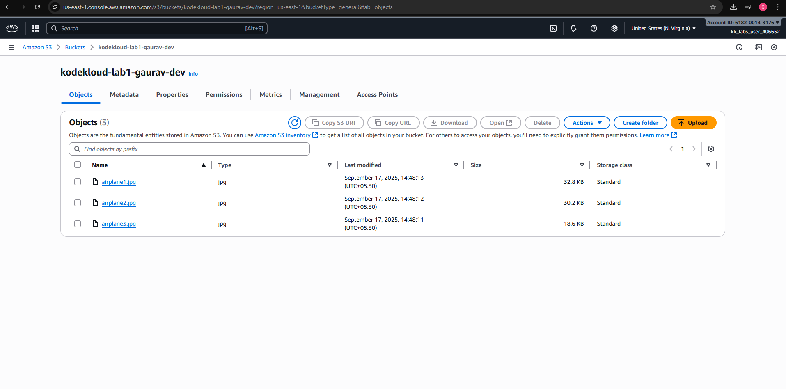

# Lab 2 – Upload Files to S3 Bucket

### 🎯 Objective
Upload three airplane images to an existing bucket (`kodekloud-lab1-`).

---

### 🛠️ Steps Performed
1. Downloaded airplane images
2. Opened bucket: `kodekloud-lab1-gaurav`
3. Uploaded files:
   - airplane1.jpg
   - airplane2.jpg
   - airplane3.jpg
4. Verified via AWS Console

---

### ✅ Verification
- Files successfully listed in bucket
- Screenshot attached below

---

### 📸 Screenshots
- S3 bucket file list
  
